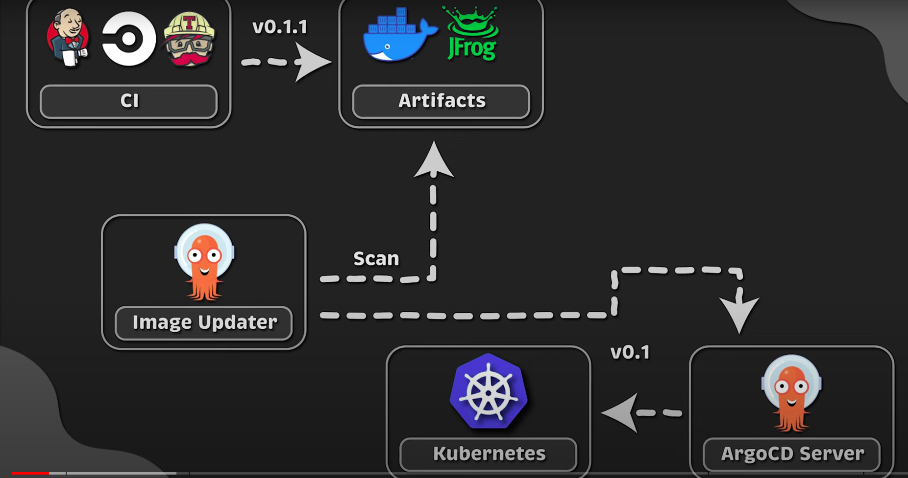
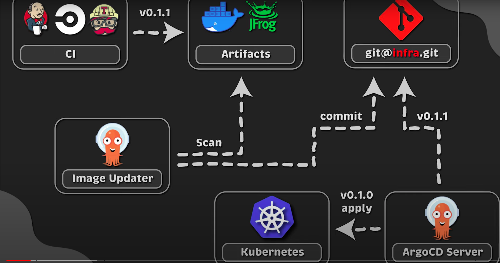

# Argo CD

## configuring Argo CD with kubernetes

1. install argocd in kubernetes cluster.
 we can use helm to install the argocd manually or using terraform
 ```bash
    helm install argocd -n argocd --create-namespace argocd/argo-cd --version 3.35.4 -f terraform/values/argocd.yaml
 ```

 with terraform we can run `init` and `apply` to create argocd using helm provider

2. After the initial setup, we need password to login into the argocd dashboard
```bash
    kubectl get secret -n argocd
```
it will list the secret in the argocd namespace, we need `argocd-initial-admin-secret` and get the base64 encoded password
```bash
    kubectl get secrets -n argocd argocd-initial-admin-secret -o yaml
```

copy the password field and run the below command to get the password
```bash
echo "<password>" | base64 -d
```
*Note*: you need to ommit the last character %, it indicate the end of the password

3. To access the argocd dashboard, we can port-forward it and access it locally
```bash
kubectl port-forward svc/argocd-server -n argocd 8080:80
```

username: admin
password: <password>


## Application Object
Now, we want to monitor the github repo where my kubernetes manifest file will reside

Github repo I am using is https://github.com/mehedi-iut/argocd_test.git and the path is `manifests` folder

first we need to create `application.yaml` file
```yaml
apiVersion: argoproj.io/v1alpha1
kind: Application
metadata:
  name: golang-app
  namespace: argocd
spec:
  project: default
  source:
    repoURL: https://github.com/mehedi-iut/argocd_test.git
    targetRevision: HEAD
    path: manifests
  destination:
    server: https://kubernetes.default.svc
```

as our argocd pods is deployed in `argocd` namespace, we added that namespace in the application spec

in the dashboard we will find application with name `golang-app` as we define in the application.yaml file

*Note*: you must add namespace even though it will deploy in default namespace otherwise argocd will show error

currently, in argocd dashboard the app status is out of sync, because we didn't add any sync in application.yaml file
for now, we need to manually click on the sync button in the dashboard, and then click synchronization button.
After that we will get our pods in kubernetes


## Adding sync in application.yaml file
```yaml
apiVersion: argoproj.io/v1alpha1
kind: Application
metadata:
  name: golang-app
  namespace: argocd
spec:
  project: default
  source:
    repoURL: https://github.com/mehedi-iut/argocd_test.git
    targetRevision: HEAD
    path: manifests
  destination:
    server: https://kubernetes.default.svc
  syncPolicy:
    automated:
      selfHeal: true
      prune: true
      allowEmpty: false
    syncOptions:
      - Validate=true
      - CreateNamespace=true
      - PrunePropagationPolicy=foreground
      - PruneLast=true
```

now if we make any changes in deployment.yaml file it will automatically sync and it may take 5 minutes to deploy the changes

## Delete application and argocd application object
with current argocd application object, if we delete application object of argocd , it will not delete the application object state from argocd, but we want to delete it from k8s and argocd 
to enable deleting argocd application object from k8s and argocd state, we need to add below metadata
```yaml
metadata:
  name: golang-app
  namespace: argocd
  finalizers:
    - resources-finalizer.argocd.argoproj.io
```

after adding the finalizers, if we delete our application object it will also delete from the argocd state.


### apps of apps pattern
for maintaining multiple project in argocd using application object, we can create global argocd application object which will point to the folder path where child application object which is handling the manifest deployment in k8s. you can check the `2-example` folder for global application yaml file

and in our test repo `https://github.com/mehedi-iut/simple-go-app.git` we have `gitops/environment/staging/apps` which contain two application object to maintain two application in k8s. if we apply `2-example` manifest file, we will get two application deployed in k8s and if we delete it, that will remove two applications from the cluster


### private repo
To enable ArgoCD to deploy from private git repository, we can use same application object yaml file from previous example but we need to first create a kubernetes secret using private git repo credential like ssh key or PAT token. in `3-example` we have `git-repo-secret.yaml` file, where we can use ssh private key to authenticate to private repo. 
so, first we need to deploy the `git-repo-secret.yaml` file then `application.yaml` file


### helm chart deployment
we can deploy helm chart on k8s uisng argocd, below application.yaml file can be used to deploy metrics-server helm chart on k8s
```yaml
apiVersion: argoproj.io/v1alpha1
kind: Application
metadata:
  name: golang-app
  namespace: argocd
  finalizers:
    - resources-finalizer.argocd.argoproj.io
spec:
  project: default
  source:
    repoURL: https://kubernetes-sigs.github.io/metrics-server/
    targetRevision: 3.8.4
    chart: metrics-server
    helm:
      version: v3
      releaseName: my-metrics
      passCredentials: false
      parameters:
        - name: "image.tag"
          value: v0.6.2
      values: |
        defaultArgs:
        - --cert-dir=/tmp
        - --kubelet-preferred-address-types=InternalIP,ExternalIP,Hostname
        - --kubelet-use-node-status-port
        - --metrics-resolution=15s
        - --kubelet-insecure-tls
  destination:
    server: https://kubernetes.default.svc
  syncPolicy:
    automated:
      selfHeal: true
      prune: true
      allowEmpty: false
    syncOptions:
      - Validate=true
      - CreateNamespace=true
      - PrunePropagationPolicy=foreground
      - PruneLast=true
```

### kustomization
we can use kustomization to replace variable and added different field when deploying to k8s, for example
we create base template for deployment
```yaml
apiVersion: apps/v1
kind: Deployment
metadata:
  name: simple-go-server
spec:
  replicas: 3
  selector:
    matchLabels:
      app: simple-go-server
  template:
    metadata:
      labels:
        app: simple-go-server
    spec:
      containers:
      - name: simple-go-server
        image: mehedi02/simple-go-server:v4.0.0
        ports:
        - containerPort: 9090
        resources:
          requests:
            cpu: "100m"
            memory: "100Mi"
          limits:
            cpu: "500m"
            memory: "500Mi"

```

here, we don't add any namespace field but Argo CD, needed namespace field, we will add to through kustomization
then in the same folder, we need to add `kustomization.yaml` file
```yaml
apiVersion: kustomize.config.k8s.io/v1beta1
kind: Kustomization
metadata:
  name: argo
resources:
  - deployment.yaml
```

Now we can add another kustomization file in a folder which is targeted by ArgoCD application object. let's say `gitops/environments/dev/my-app`

in that folder, we will create `kustomization.yaml` file with below content
```yaml
namespace: dev
images:
  - name: mehedi02/simple-go-server
    newTag: v1.0.4
resources:
  - ../../../../my-app-base
```


now in `application.yaml` file for ArgoCD, we can target `gitops/environments/dev/my-app` and kustomize will handle the rest
```yaml
apiVersion: argoproj.io/v1alpha1
kind: Application
metadata:
  name: golang-app
  namespace: argocd
  finalizers:
    - resources-finalizer.argocd.argoproj.io
spec:
  project: default
  source:
    repoURL: https://github.com/mehedi-iut/simple-go-app.git
    targetRevision: HEAD
    path: gitops/environments/dev/my-app
  destination:
    server: https://kubernetes.default.svc
    # namespace: default
  syncPolicy:
    automated:
      selfHeal: true
      prune: true
      allowEmpty: false
    syncOptions:
      - Validate=true
      - CreateNamespace=true
      - PrunePropagationPolicy=foreground
      - PruneLast=true
```

# Image Updater
Argo CD uses two methods to update the image tag and deploy to kubernetes and both are *write back methods*
* argocd

* git


for more documentation. follow this [link](https://argocd-image-updater.readthedocs.io/en/stable/basics/update-methods/#update-methods)


## Installation using Helm
1. add helm repo 
  ```bash
  helm repo add argo https://argoproj.github.io/argo-helm
  ```
2. update the helm index
  ```bash
  helm repo update
  ```
3. Now, search for argocd
  ```bash
  helm search repo argocd
  ```
4. as we install argocd using terraform, here we will install image updater, we need to override some default values of image updater helm chart, so first we need default value yaml file, to get run below command
  ```bash
  helm show values argo/argocd-image-updater --version 0.11.0 > argocd-image-updater.yaml
  ```
  from this file `argocd-image-updater.yaml` we can take our specific value and create new values.yaml file to override
5. we will create `image_updater.yaml` file inside `terraform/values` folder, and updated the image tag and enable metrics server
  ```yaml
  image:
  tag: "v0.14.0"

  metrics:
    enabled: true
  ```

6. now, we can create image updater using helm cli or we can use terraform to do that like we do in argo installation.
  * using helm cli
    ```bash
    helm install updater -n argocd argo/argocd-image-updater --version 0.11.0 -f terraform/values/image_updater.yaml
    ```
  * using Terraform, first create `image_updater.tf` inside `terrform` folder
    ```tf
    resource "helm_release" "updater" {
      name = "updater"

      repository       = "https://argoproj.github.io/argo-helm"
      chart            = "argocd-image-updater"
      namespace        = "argocd"
      create_namespace = true
      version          = "0.11.0"

      values = [file("values/image_updater.yaml")]
    }
    ```

    run ```terraform apply -auto-approve``` to create image updater

## Test image updater using Kustomization
we will use Kustomization for deploying our application. To use image updater we need to add below annotation in application.yaml file
```yaml
annotations:
  argocd-image-updater.argoproj.io/image-list: mehedi02/simple-go-server:~v0.1
```

here we only update for patch version update and keep minor version below 2

in this way we keep our agrocd application state to argocd server, if we delete argocd application and redeploy it, it will again start from the initial state and we will lose our update that was previously present in argocd server.

so to mitigate this problem, we will use **git** write back method.

in git write back method, we need to use one more annotation along with the previous one
```yaml
annotations:
  argocd-image-updater.argoproj.io/image-list: mehedi02/simple-go-server:~v0.1
  argocd-image-updater.argoproj.io/write-back-method: git
```

and rest of the application object is same as before, the image updater will create a yaml file with name `.argocd-source-<app-name>.yaml` 
for this approach, we need to create a webhook so that argocd can detect this change and deploy


